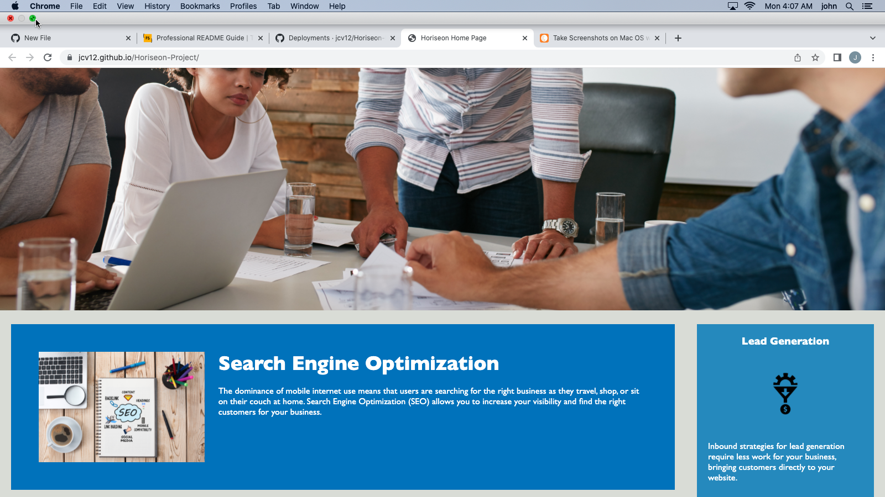

# <Horiseon-Project>

## Description

- My motivation for this project was to improve my skills as a web developer
- I built this project to practice my uses of basic HTML and CSS
- It allows for a nice professional format for other websites
- I learned to be patient with the smaller details and how to work with GitHub Pages

## Installation

There is no installation required as it is put on github pages

## Usage

    ```md
    
    ```

## Credits
John Vayianos
